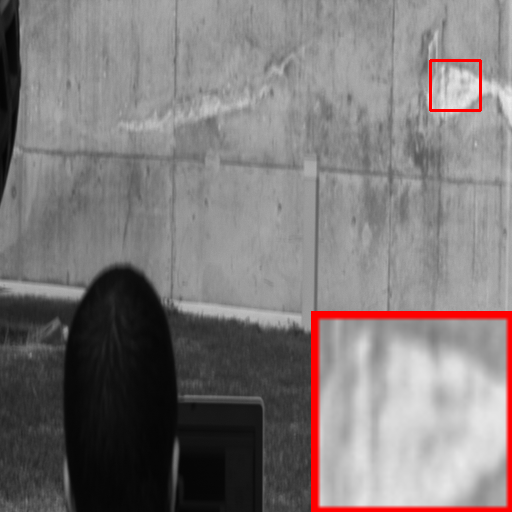
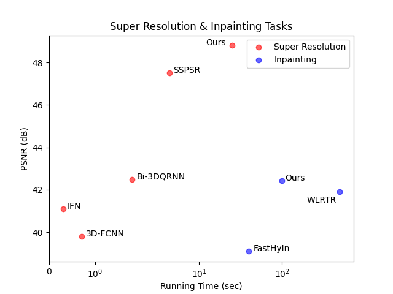

# Paper utils in Python

This repository contains some utility scripts for creating figures in deep learning papers.

这个仓库包含了一些用于制作深度学习论文插图的Python脚本。

## List of scripts

1. **add magnifier box**: [Code](addbox/addbox.py)



2. **scatter plot with annoations**: [Code](scatter/scatter_plot.py)



## Notes

### Insert video in GitHub Readme
```
https://user-images.githubusercontent.com/46140458/116817761-47885e80-ab68-11eb-9975-d61d5a919e13.mp4
```

https://user-images.githubusercontent.com/46140458/116817761-47885e80-ab68-11eb-9975-d61d5a919e13.mp4
